# Discord Bot

This project is a Discord bot built with `discord.js`. The bot includes various functionalities such as polls, automated responses, and more. Below are the instructions on how to run the bot and create new commands.

## Requirements

- Node.js (version 20 or higher)
- Yarn (optional, but recommended)

## Installation

1. Clone the repository:

   ```bash
   git clone https://github.com/TeamNovaSoft/discord-bot.git
   ```

2. Navigate to the project directory:

   ```bash
   cd discord-bot
   ```

3. Install the dependencies:
   ```bash
   yarn install
   ```

## Configuration

1. Create a new file called `.env` based on the `.env.example` file in the root of the project with the following keys, filled it with the information of your bot:

   ```
     DISCORD_TOKEN = YOUR_BOT_TOKEN
     DISCORD_CLIENT_ID = YOUR_CLIENT_ID
     DISCORD_GUILD_ID = YOUR_GUILD_ID
   ```

   - **DISCORD_TOKEN**: Your Discord bot's token.
   - **DISCORD_CLIENT_ID**: Your bot's client or application ID.
   - **DISCORD_GUILD_ID**: The ID of the server (guild) where the commands will be deployed.

To obtain each of these environment variables, you need to have `Developer Mode` enabled in Discord (if it is not already).

Open Discord to enable developer mode and click on the gear icon (User Settings) at the bottom left.

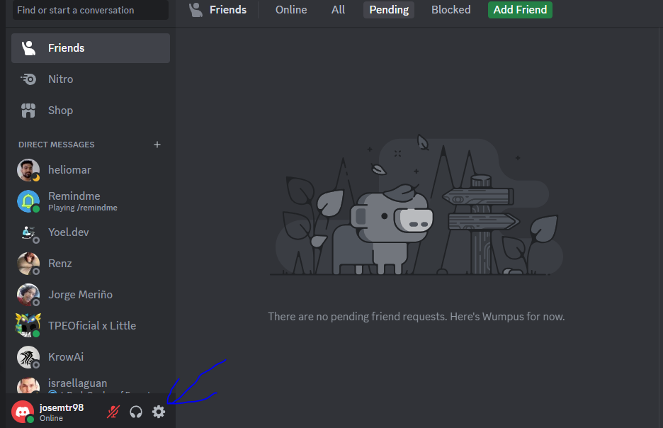

Go to `App Settings` in your discord app

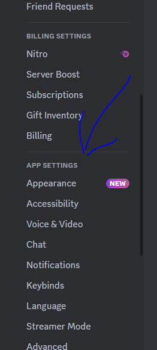

and select the `Advanced` option, then look for the `Developer Mode` option and toggle it on. For more details on how to create a Discord bot, you can visit the official Discord guide.

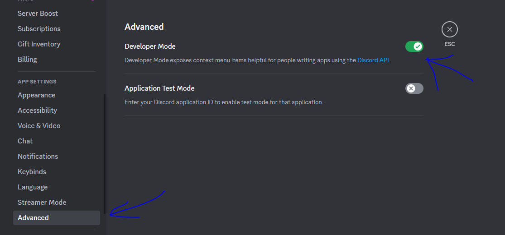

Once `Developer Mode` is enabled, you can also follow this documentation for creating a Discord bot: [Discord setting up a bot Guide](https://discordjs.guide/preparations/setting-up-a-bot-application.html#creating-your-bot). You can follow these steps to obtain Environment Variables:

### 1. Obtain **DISCORD_TOKEN**

- Go to the [Discord Developer Portal](https://discord.com/developers/applications) and log in and create a new application by clicking on `New Application`.

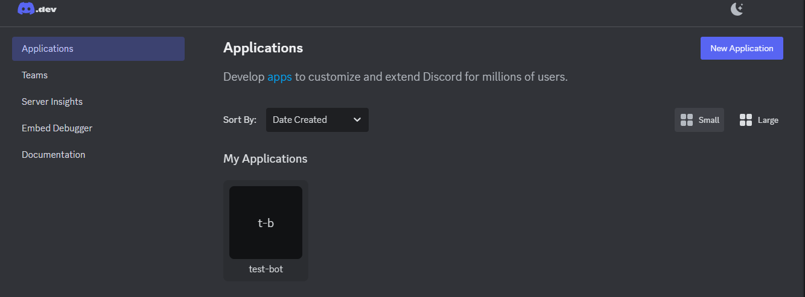

- Name your application and click `Create`.

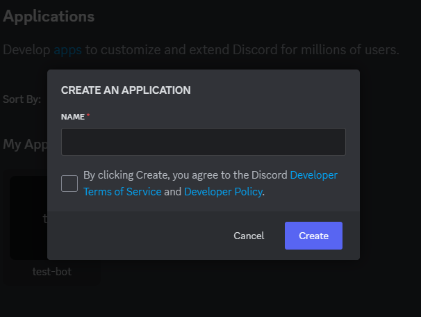

- In the `Bot` section, click on `Reset Token` and confirm.

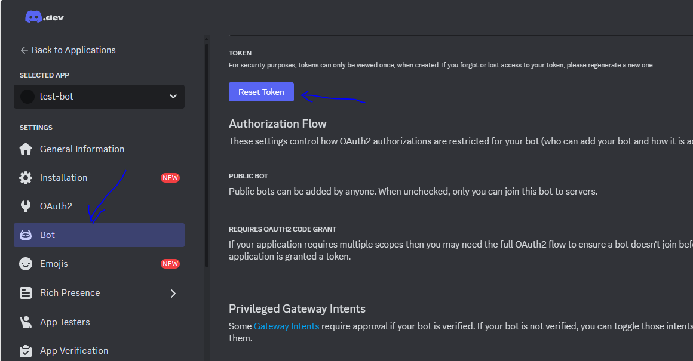

- Copy the bot token that is generated. This is your **DISCORD_TOKEN**.

### 2. Obtain **DISCORD_CLIENT_ID**

- Go to the [Discord Developer Portal](https://discord.com/developers/applications).


- Go to `OAuth2` or `General information` section.

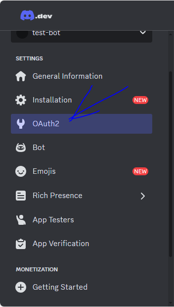

- In `OAuth2` section there is a card with client information and there is CLIENT ID

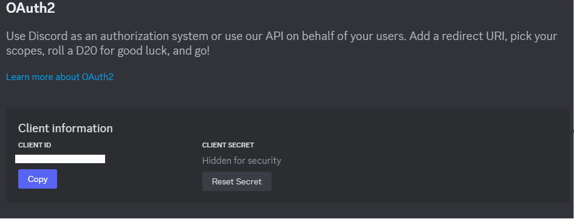

- In case of `General information` section there is a card with client information and there is CLIENT ID


- You will find the option to copy the `Client ID` or `Application ID`. This is your
  **DISCORD_CLIENT_ID**.

### 3. Obtain **DISCORD_GUILD_ID**

- Open [Discord](https://discord.com/app) and go to the server from which you want to obtain the ID.

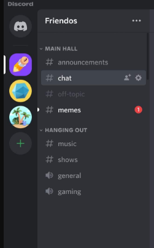

- Right-click on the server name and select `Copy Server ID`. This is your **DISCORD_GUILD_ID**.

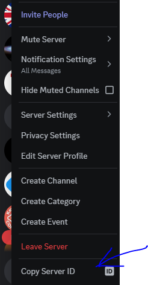

## Running the Bot

1. Start the bot with the following command:

   ```bash
   yarn start
   ```

   This will run the bot and connect it to Discord. You should see a message in the console indicating that the bot is ready and logged in.

## [Creating New Commands](docs/creating-commands.md)

For detailed instructions on how to create new commands, see [Creating New Commands](docs/creating-commands.md).

## Additional Permissions Configuration
To correctly install the bot on Discord and ensure it can receive and process messages, certain permissions must be configured both in the Discord Developer Portal and in the bot's code. Here are the steps and necessary permissions:
### Additional Permissions Configuration
1. Access the Discord Developer Portal:
   Go to the Discord Developer Portal and select your bot application. 
2. Configure the Bot's Scopes and Permissions:
   - In the `Bot` section and check `Message Content Intent` permission to allow app bot the access to content message.
   
   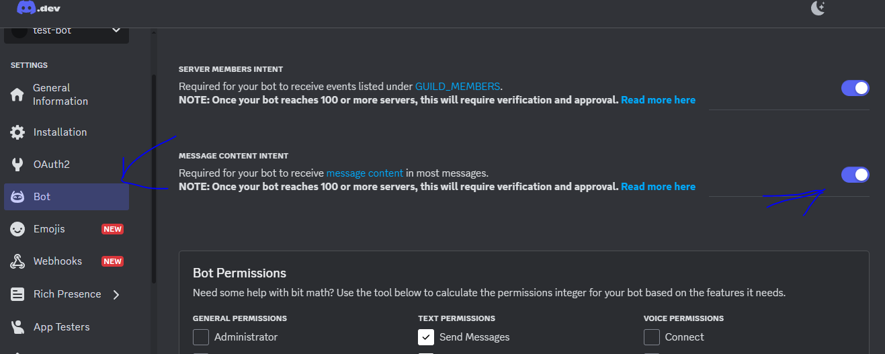
   - Navigate to the `Installation` section and then add the select the key permissions.
   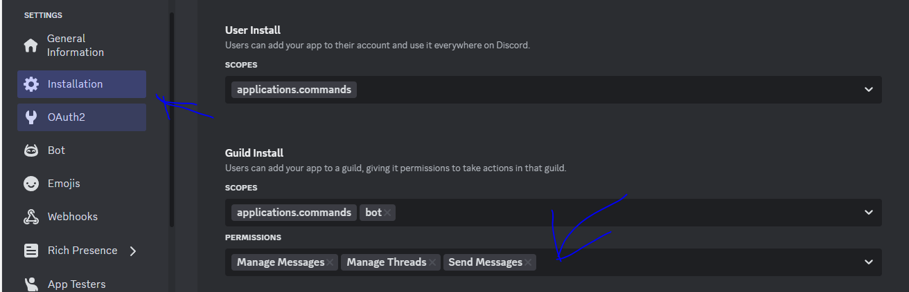
   - Copy install Link to add your bot in the guild/server.
   
   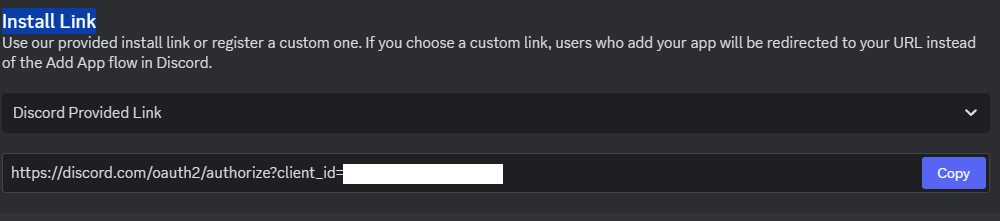
Configuring these permissions and intents ensures that your bot can operate effectively, receiving and processing messages as needed.
## Additional Environment Variables
To schedule automated messages, you can configure the following additional environment variables in your `.env` file:
- **SCHEDULED_MESSAGES**: A CSV string where each entry is separated by a semicolon (`;`) and contains three values separated by commas (`channel,datetime,message`). The `channel` is the Discord channel where the message will be sent, `datetime` is the date and time in ISO 8601 format (e.g., `2024-11-15T10:00:00`), and `message` is the content of the message to be sent.
For example:
```
SCHEDULED_MESSAGES="canal1,2024-11-15T10:00:00,Hello World!;canal2,2024-11-15T12:00:00,Good Morning!"
```
This example will schedule two messages:
- "Hello World!" will be sent to `canal1` on `2024-11-15` at `10:00 AM`.
- "Good Morning!" will be sent to `canal2` on `2024-11-15` at `12:00 PM`.
- **TIME_ZONE**: The time zone in which the scheduled messages should be executed. For example, `America/Argentina/Buenos_Aires` can be used for Argentina's time zone.
### Cron Job Time Format
The `datetime` field in `SCHEDULED_MESSAGES` follows the ISO 8601 format:
```
YYYY-MM-DDTHH:mm
(e.g., 2024-11-15T10:00:00)
```
- **YYYY**: Year (e.g., `2024`)
- **MM**: Month (e.g., `11` for November)
- **DD**: Day of the month (e.g., `15`)
- **T**: Separator between the date and time components
- **HH**: Hour in 24-hour format (e.g., `10` for 10 AM)
- **mm**: Minutes (e.g., `00` for the start of the hour)
- **ss**: Seconds (optional, defaults to `00`)
### Example `.env` Configuration
```
SCHEDULED_MESSAGES="canal1,2024-11-15T10:00:00,Hello World!;canal2,2024-11-15T12:00:00,Good Morning!" TIMEZONE="America/Argentina/Buenos_Aires"
```

To send a notification message to the specified channel, informing admins or moderators of the point request and providing relevant details the users can use the `/request-point` command in a thread and the bot will do. To allow this, you must configure in the `env` file:

- **ADMIN_POINT_REQUEST_CHANNEL**: environment variable specifies the ID of the Discord channel where point review requests are sent. This is particularly useful for managing and tracking user actions that require admin review.

When the bot needs to notify or alert the administrators by mentioning them directly. For example, when a user requests a point review, the bot can mention the administrators to ensure they see and act on the request promptly.

- **ADMINISTRATOR_TAG_ID**: environment variable specifies the ID or tag that the bot uses to mention administrators in Discord. This is useful in various scenarios where administrative intervention is required, such as when users need help, when certain actions need approval, or when there are issues that require immediate attention.

## Google Calendar Integration

To integrate the bot with Google Calendar, you need to obtain service account keys from Google Cloud. Follow these steps to set it up correctly:

### Create and Configure the Project in Google Cloud

1. **Access Google Cloud Console**:
   - Go to [Google Cloud Console](https://console.cloud.google.com/) and sign in with your Google account.

2. **Create a New Project**:
   - Click on the project dropdown at the top and select "New Project."
   - Assign a name to your project and click "Create."

3. **Enable the Google Calendar API**:
   - Within your project, go to **API & Services** > **Library**.
   - Search for "Google Calendar API" and click "Enable."

4. **Create a Service Account**:
   - Go to **API & Services** > **Credentials**.
   - Click "Create Credentials" and select "Service Account."
   - Provide a name for the service account and complete the setup.

5. **Generate a Key for the Service Account**:
   - After creating the service account, select "Create Key."
   - Choose the JSON format and download the key file.

6. **Grant Permissions to the Service Account**:
   - Open Google Calendar with the account you want to integrate.
   - Share the calendar with the service account email address (something like `your-service-account@your-project.iam.gserviceaccount.com`).
   - Assign the "Make changes to events" permission.

### Configure the Key File

1. Save the downloaded file (`google-keys.json`) in the root of your project. **Make sure to add it to your `.gitignore` file** to avoid exposing it in your repository.

### Environment Variables Configuration
To ensure the integration works seamlessly, you need to set up the following environment variables in your .env file:

1. GOOGLE_EMAIL:
   - Description: The Google account email associated with the calendar.
   - Example:
      ```
      GOOGLE_EMAIL=your-google-account@example.com
      ```

2. CHANNEL_CALENDAR_ID:
   - Description: The ID of the Discord channel where calendar notifications will be sent.
   - Example:
      ```
      CHANNEL_CALENDAR_ID=1306251153855610922
      ```

3. SCHEDULED_CALENDAR_ENABLED:
   - Description: A boolean flag to enable or disable the scheduled calendar functionality.
   - Example:
      ```
      SCHEDULED_CALENDAR_ENABLED=false
      ```
